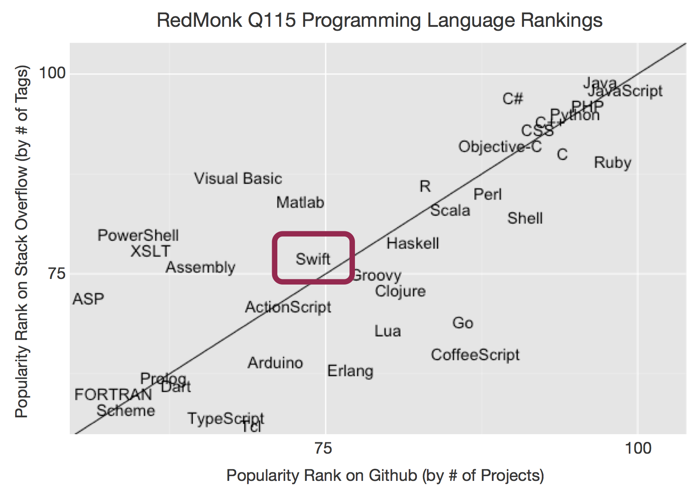
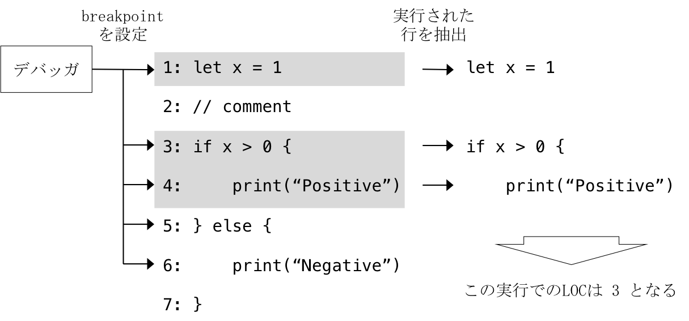
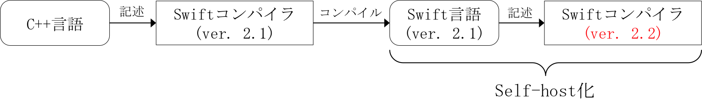
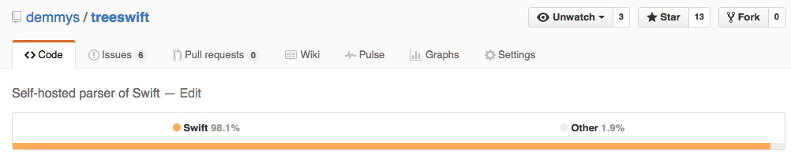
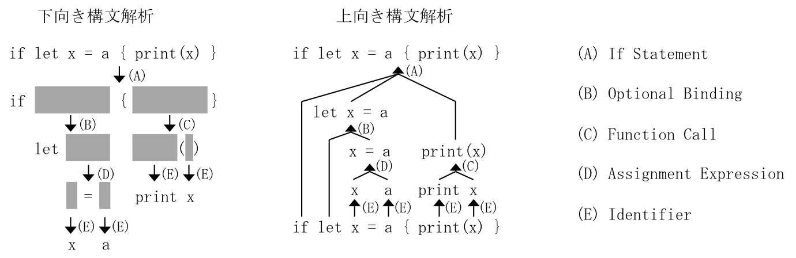
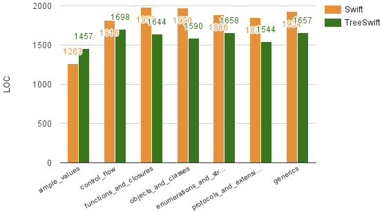
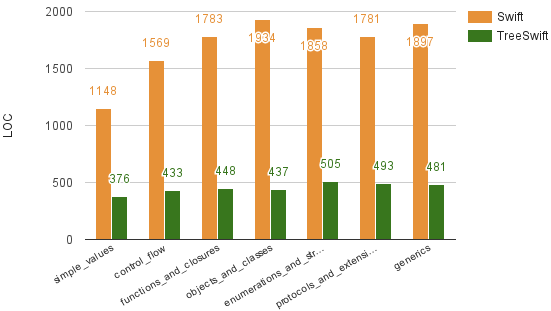

class: title

.long-title[
# Self-host化によるSwiftコンパイラの<br>ソースコード可読性の向上
]

環境情報学部4年 Arch

出水 厚輝 (demmy)

---

## 背景 (1/2)

.margin-top-small.center[
2014年6月 Apple社がMac OS X/iOS開発言語としてSwiftを発表
]

.margin-top-small.image-middle.center[

]

.padding-left-small.margin-left-large[
* 汎用高級コンパイラ型プログラミング言語
* Objective-Cの代替言語として爆発的にユーザが増加
]

---

## 背景 (2/2)

.margin-top-large.center[
### 2015年12月 Swiftがオープンソース化
]

.margin-top-middle.margin-left-large[
* 多くの人がソースコードを参照するようになる
* 様々なプログラマが開発に加わるようになる
* 拡張/修正の頻度が上がりレビュー量が増加する
]

.margin-top-middle.center[
#### 可読性の向上がプロジェクトの活性化に<br>大きく関与するように
]

???

つい先日Swiftがオープンソース化した
多くの人が関わるようになると、開発に加わるハードルやレビューのスピードに影響する可読性がプロジェクトの活性化に大きく関与する

---

## 本研究の目的

.margin-top-large.center[
#### Swiftコンパイラの可読性を向上する
]

.font-large.margin-top-middle.margin-left-large.padding-left-middle[
1. 可読性の定義
3. 可読性を向上するアプローチ
4. アプローチを実現する実装
5. アプローチの評価
]

???

そこで本研究は、Swiftコンパイラの可読性を向上することを目的としている

この発表では、可読性の定義を明確にした後、アプローチとその実装について話し、最後に評価結果について説明する

まずは、可読性といっても様々な物が考えられるので、本研究における可読性の定義について説明する

---

## 可読性の要素 .font-tiny[ー 可読性の定義]

| 種類 | 要素の例 |
|:---:|:---:|
| 処理の複雑さ | データ構造、アルゴリズム、制御構造 |
| 説明の適切さ | コメント、名前付け、インデント |
| 知識の多さ | 読者の知識、手法の種類 |

* 説明の適切さはレビューなどで維持向上できる
* 知識の差などはドキュメントの追加によって補完されていっている

.center[
#### 本研究では処理の複雑さを可読性の主要因と考える
]

???

可読性には様々な要素がある

その特徴から3種類に分類すると、

コメントや名前付けなどはレビューで指摘されある程度保たれるし、
プログラム読者の知識を補完するためのドキュメントなどはオープンソースプロジェクトでは随時追加されて行っているので

本研究では処理の複雑さが可読性低下の主要因となると考え、
可読性は処理の複雑さに基づくと考える

---

## 処理の複雑さを表す指標 .font-tiny[ー 可読性の定義]

1980年代にソフトウェア・メトリクスとしてソフトウェアの複雑さを定量化する手法が盛んに研究された

.font-small[
| 手法 | 指標 |
|:---:|:---|
| Lines of Code (LOC) .footnote[※1] | ソースコードの実行可能な行数 |
| Halstead Complexity Metrics (HCM) .footnote[※1] | 演算子と被演算子の種類と数 |
| Cyclomatic Complexity Metric (CCM) .footnote[※1] | 分岐の数 |
| Function Point (FP) .footnote[※2] | 入出力の数 |
]

.inverted.center[
#### コンパイラを対象とする場合に有効な手法は限られる
]

.font-small[
.footnote[※1 Sheng Yu and Shijie Zhou. A survey on metric of software complexity. Information Management and Engineering (ICIME), 2010 The 2nd IEEE International Conference on. IEEE, pages 512–521, 1982.]
.footnote[※2 Charles R. Symons. Function point analysis: Difficulties and improvements. Software Engineering, IEEE Transactions on 14.1, pages 2–11, 1988.]
]

???

可読性を

---

## コンパイラにおける複雑さ .font-tiny[ー 可読性の定義]

### 複雑を考える上でのコンパイラの特徴

* 非常に巨大なソフトウェアである
* 基本的な機能と特殊な機能が混在している
* 複数の独立した処理ステップから成る

.inverted.center[
#### 各部分の複雑さが打ち消し合う懸念
]

### 複雑さを計測するための条件

1. .highlight[基本的な機能のみ]を対象とした計測を行う
2. .highlight[特定の処理ステップのみ]を対象とした計測を行う

---

## 基本機能のみを対象とする方法 .font-tiny[ー 可読性の定義]

1. Swiftの基本的な構文を使うサンプルプログラムを用意
2. サンプルプログラムをコンパイルするために必要な箇所だけを抜粋
3. 抜粋箇所のみを対象に複雑さを計測

.center[
この方法で適用可能な計測手法は限られる
]

.stuff-table.font-small[
| 手法 | 可用性 |
|:---:|:---:|
| .bold.highlight[Lines of Code] | .bold.highlight[◎]<br> |
| Halstead Complexity Metrics | △<br>(部分的なプログラムでは値が偏る) |
| Cyclomatic Complexity Metric | ×<br>(分岐が分解されてしまう) |
| Function Point | ×<br>(入出力はほとんどない) |
]

---

## 具体的な計測方法 .font-tiny[ー 可読性の定義]

.margin-top-middle.center.image-middle[

]

.center[
#### 本研究では実行部分LOCでコンパイラの可読性を表す
]

---

## 特定処理のみを対象とする方法 .font-tiny[ー 可読性の定義]

.margin-top-middle.center[
Swiftコンパイラの構成
]
.margin-top-middle.image-width-max[

]

.margin-top-middle[
* 各処理ステップは前のステップの結果に依存している
* ある処理ステップまでで実行を止めるオプションが存在する
* 他のミドルウェアに依存したステップはAPIの差が影響を与える
]

.margin-top-middle.center[
#### 本研究では構文解析のみを対象とする
]

---

## 本研究の目的

.margin-top-middle.font-large.center[
構文解析器の実行部分LOCを削減することで
]
.center[
#### Swiftコンパイラの可読性を向上する
]

.font-large.margin-top-middle.margin-left-large.padding-left-middle[
1. .disable[可読性の定義]
3. 可読性を向上するアプローチ
4. アプローチを実現する実装
5. アプローチの評価
]

---

## 実行部分LOCの削減手法 (1/2) .font-tiny[ー アプローチ]

.margin-top-small[
* 複数のStatementを1行に記述する
* 文法を直感的な別の言語で記述し解析器を自動生成する
* 文法を必要なステップが少なくなるように変更する
* ...
]

.inverted.margin-top-small.center[
#### 上記手法は可読性が向上するという明確な根拠がない
]

.center.margin-top-small[
一方でコンパイラを対象言語で書き直すSelf-host化という手法がある
]

.margin-top-middle.image-width-max[

]

---

## 実行部分LOCの削減手法 (2/2) .font-tiny[ー アプローチ]

.horizontal[
.stuff-table.width-half.font-tiny[
| 順位 | 言語 | Self-host化したコンパイラ |
|:---:|:---:|:---:|
| 3 | C++ | clang, gcc |
| 4 | C# | .NET Compiler Platform |
| 5 | Python | PyPy |
| 7 | Visual Basic .NET | .NET Compiler Platform |
| 12 | Delphi/Object Pascal | Free Pascal |
| 17 | Groovy | groovy |
| 21 | D | DMD |
| 27 | Lisp | clisp |
| 28 | Ada | GNAT |
| 30 | Scala | scala |
]

.box[
.center.font-small[
TIOBE Programming Indexの30位中10個の言語がSelf-host化されている
]
* 新しく作られる汎用言語は
  .highlight[より表現力が高い]ことが多い
* ある構文をその構文を用いて.highlight[より簡単に記述できる]
* コンパイラの開発用に.highlight[異なる言語を学ぶ必要がなくなる]
]
]

.center[
#### Self-host化で可読性を向上できると期待できるため<br>本研究のアプローチとして用いる
]

---

## 本研究の目的

.margin-top-small.font-large.center[
Self-host化によって<br>構文解析器の実行部分LOCを削減することで
]
.center[
#### Swiftコンパイラの可読性を向上する
]

.font-large.margin-top-middle.margin-left-large.padding-left-middle[
1. .disable[可読性の定義]
3. .disable[可読性を向上するアプローチ]
4. アプローチを実現する実装
5. アプローチの評価
]

---

## Swiftの構文解析器の構成 .font-tiny[ー 実装]

.center.margin-top-middle.image-width-max[

]

.margin-top-small.horizontal[
.image-middle[

]

.margin-left-small[
1. モジュール定義ファイルからライブラリ、ソースファイルからコンパイルするプログラムを読み込み
2. 字句解析器で各ファイルの文字列を字句に分解
3. 構文解析で各字句からASTを生成
]
]

---

## Self-host化した構文解析器の実装 .font-tiny[ー 実装]

### TreeSwift .font-tiny[ー 本研究で実装したSelf-host化されたSwift構文解析器]

.image-width-max[

]

* Makefile以外100%Swiftのみで実装
* 総行数約10000行
* 構文解析器以外についても一部実装し有用性を検証済

.inverted.center[
#### 各処理における特徴について順に説明
]

---

## 字句解析 .font-tiny[ー 実装]

.margin-top-small.center[
Swiftの字句は複雑な構造を持つ
]

.horizontal[
```cpp
1_000 // 数値区切り
"x: \(x)" // 文字列への式挿入
```

```cpp
i+++i // 二項演算子 +++
i++ + i // 後置演算子 ++
```
]

.horizontal[
.image-width-max[

]

字句解析器を各字句を解析する小さなオートマトンの集合として実装
]

.inverted.center[
#### 字句解析がより多くの処理を行うように実装
]

---

## 構文解析 .font-tiny[ー 実装]

.horizontal[
Swiftの高度な構文を解析するプログラムは自動生成が難しい

.stuff-table.font-small.width-half[
| 解析手法 | 手作業での実装 | 自動生成 |
|:---:|:---:|:---:|
| 下向き | ○ | × |
| 上向き | × | ○ |
]
]

.center.image-small[

]

.inverted.center[
#### Swiftと同じLL(k)クラスの再帰下降構文解析で実装
]

---

## モジュール定義 .font-tiny[ー 実装]

* 標準ライブラリ中の定義などはテキストファイルによるモジュール定義ファイルによって読み込まれる

.font-small[
```cpp
public struct Int {
    public init (_builtinIntegerLiteral value: Builtin.Int64)
}
public func +(lhs: Int, rhs: Int) -> Int
```
]

* 標準ライブラリの実装は直接LLVM-IRで記述してDLL化

.font-small[
```llvm
%_MS9TreeSwift3Int = type <{ i64 }>
define %_MS9TreeSwift3Int @_MO9TreeSwift1a_MS_MS9TreeSwift3Int_9TreeSwift3Int_MS9TreeSwift3Int(%_MS9TreeSwift3Int, %_MS9TreeSwift3Int) {
entry:
    %2 = extractvalue %_MS9TreeSwift3Int %0, 0
    %3 = extractvalue %_MS9TreeSwift3Int %1, 0
    %4 = add i64 %2, %3
    %5 = call %_MS9TreeSwift3Int @_MSI9TreeSwift3Int_LMT22_builtinIntegerLiteral7Builtin5Int64_MS9TreeSwift3Int(i64 %4)
    ret %_MS9TreeSwift3Int %5
}
```
]

---

## エラー検出 .font-tiny[ー 実装]

* 文法から静的に検出できるエラーは全て検知

```cpp
// 意味解析で型の不整合として検出
func noReturn() -> Int {
    return
}

// 現在のTreeSwiftでは検出不可
// (Apple社のSwiftではSIL解析で不整合として検出)
func notInitialized(f: Bool) {
    let x: Int
    if f {
        x = 10
    } else {
    }
    print(x)
}
```

* エラー回復は未実装

---

## 本研究の目的

.margin-top-small.font-large.center[
Self-host化によって<br>構文解析器の実行部分LOCを削減することで
]
.center[
#### Swiftコンパイラの可読性を向上する
]

.font-large.margin-top-middle.margin-left-large.padding-left-middle[
1. .disable[可読性の定義]
3. .disable[可読性を向上するアプローチ]
4. .disable[アプローチを実現する実装]
5. アプローチの評価
]

---

## 評価方法 .font-tiny[ー 評価]

1. 2つのコンパイラの.highlight[構文解析器を対象として]
2. .highlight[基本的な構文を使ったプログラム]について実行部分LOCを測定し
3. 結果を比較/考察する

### 構文解析器のみを対象とするための条件

* swift-2.2-SNAPSHOT-2015-12-31-a を評価用に変更したものを使用
* オプションを付けて.highlight[構文解析だけを実行]
* ファイル形式が異なるため.highlight[モジュール解析は除外]

### 測定時に使用するプログラム

* .highlight[公式チュートリアル]に使用されている7つのプログラムを使用.footnote[※1]

.footnote[
※1 Trailing closureとString interpolationはTreeSwiftが未対応のため同等の構文に変更
]

---

## 測定に使用するプログラム .font-tiny[ー 評価]

.font-small[
| 対象プログラム | 行数 | 主な使用構文 |
|:---:|:---:|:---:|
| Simple Values | 25 | 変数、各種リテラル |
| Control Flow | 67 | 分岐、繰り返し、パターンマッチ |
| Functions and Closures | 69 | 関数、クロージャ |
| Objects and Classes | 82 | クラス |
| Enumerations and Structures | 62 | 列挙体、構造体 |
| Protocols and Extensions | 33 | 存在型、型拡張 |
| Generics | 25 | 全称型 |
]

.center[
#### Swiftの基本構文を充分に網羅している
]

---

## 測定結果 (1/3) .font-tiny[ー 評価]

.center[
各プログラムにおけるコンパイラ全体の実行部分LOC
]

.font-small.stuff-table[
| 対象プログラム | .center[Swift] | .center[TreeSwift<br>(提案手法)] | .center[Swiftからの減少率] |
|:---:|---:|---:|---:|
| Simple Values | 4188 | .bold[1928] | 53.96% |
| Control Flow | 5347 | .bold[2226] | 58.37% |
| Functions and Closures | 5819 | .bold[2187] | 62.42% |
| Objects and Classes | 5937 | .bold[2122] | 64.26% |
| Enumerations and Structures | 5762 | .bold[2258] | 60.81% |
| Protocols and Extensions | 5598 | .bold[2132] | 61.91% |
| Generics | 5887 | .bold[2233] | 62.07% |
]

.center.inverted[
#### ASTにおける準備処理が影響している可能性がある
]

---

## 測定結果 (2/3) .font-tiny[ー 評価]

.margin-top-small.horizontal[
.image-width-max[
.font-small.center.margin-bottom-small[
構文解析の本体を構成するファイル群
]

]

.image-width-max[
.font-small.center.margin-bottom-small[
ASTを構成するファイル群
]

]
]

AST関連部分では後ステップ用の処理が実行部分LOCを増加させている

.margin-top-middle.center[
#### 構文解析ファイル群の結果に注目する
]

---

## 測定結果 (3/3) .font-tiny[ー 評価]

.margin-top-small.center[
構文解析ファイル群で再集計した実行部分LOC
]

.font-small[
| 対象プログラム | .center[Swift] | .center[TreeSwift<br>(提案手法)] | .center[Swiftからの減少率] |
|:---:|---:|---:|---:|
| Simple Values | 1263 | .bold[1457] | .bold.highlight[-16.9%] |
| Control Flow | 1816 | .bold[1698] | 7.52% |
| Functions and Closures | 1982 | .bold[1644] | 19.0% |
| Objects and Classes | 1970 | .bold[1658] | 19.6% |
| Enumerations and Structures | 1886 | .bold[1658] | 12.3% |
| Protocols and Extensions | 1851 | .bold[1544] | 17.2% |
| Generics | 1934 | .bold[1657] | 14.6% |
]

---

## 考察 (1/2) .font-tiny[ー 評価]

### Simple Valuesにおける実行部分LOCの増加

* Simple Valuesでは様々なリテラルを用いているが使われている文法の種類は少ない

.horizontal[
TreeSwiftの高級な字句解析が使用構文の少ないプログラムでは必要以上に実行部分LOCを増やした

.image-width-max[

]
]

.inverted.center.margin-top-middle[
#### Self-host化の結果現れた変化として捉える
]

---

## 考察 (2/2) .font-tiny[ー 評価]

.margin-top-middle[
### 殆どのプログラムでの実行部分LOCの減少理由
]

* UTF-8文字の処理などプログラム中の要素を同じ構文で記述できる
* Swiftの多様なデータ構造とパターンマッチによる表現力の向上

.font-small[
| | Swift | TreeSwift |
|:---:|---:|---:|
| if文使用数の平均 | 398 | 209 |
| switch文使用数の平均 | 26 | 67 |
]

.inverted.margin-top-middle.center[
#### Self-host化による実行部分LOCの減少であるといえる
]

---

## 本研究の結論

.margin-top-middle.center[
#### SwiftコンパイラのSelf-host化によって<br>構文解析器のソースコードの実行部分LOCを<br>平均10.5%減少させることができた
]

.margin-top-middle[
.bold.center[
実行部分LOCが減少した要因はSwiftの特徴的な構文にあった
]

.margin-top-small[
* 構文解析以外のステップにおいても同様に減少を得られる可能性がある
* Swift以外の言語ではSelf-host化を行っても可読性の向上には繋がらない可能性がある
]
]
